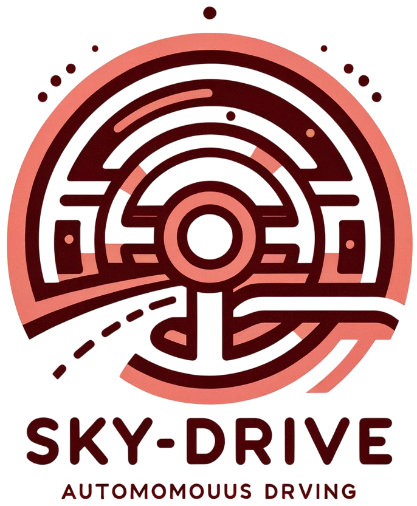
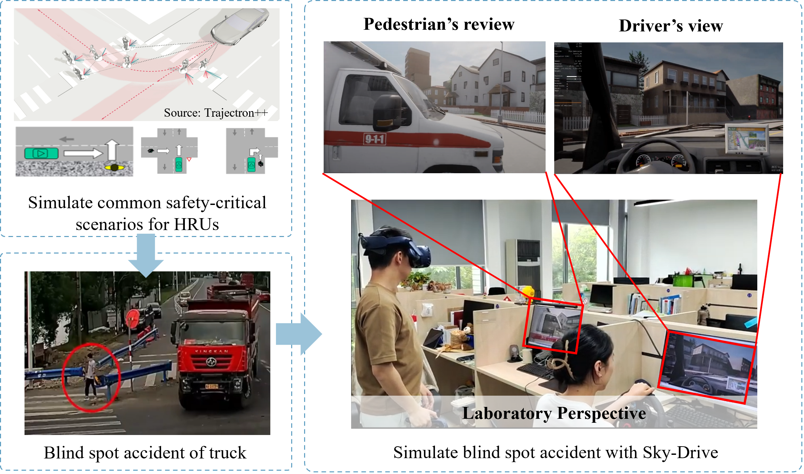
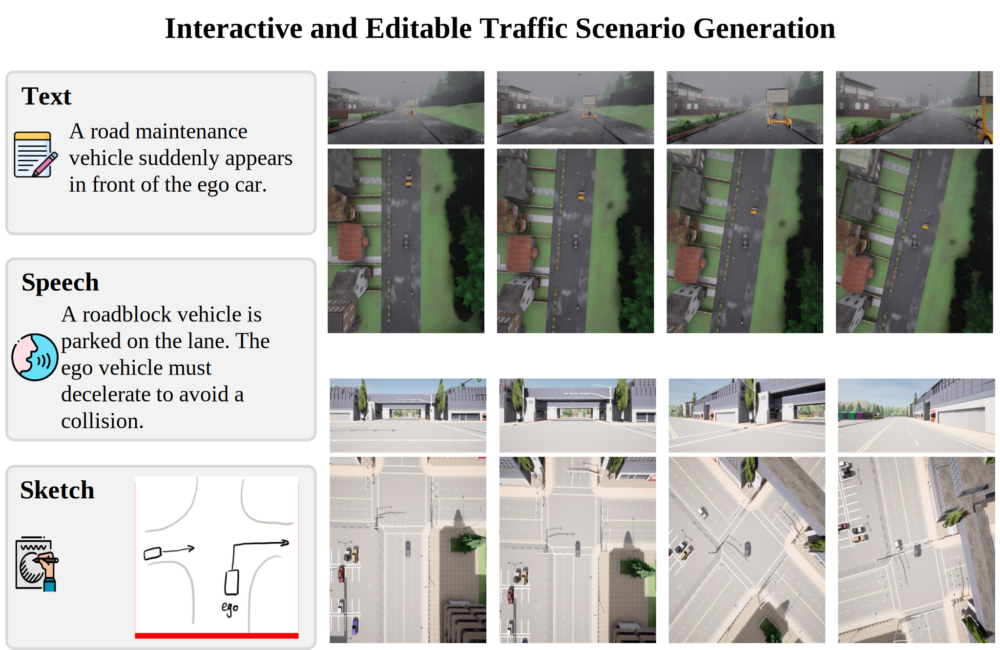
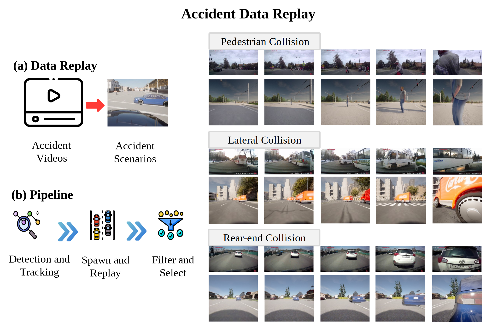

# Sky-Drive

> [!IMPORTANT]
> All code and related videos have been released as of 2025/11/20.

> 🫶 Learn more about our work and research at [Sky-Lab](https://sky-lab-uw.github.io/) website!

<div align="center">
  <div>
<h2 style="
  display:inline-flex;
  align-items:center;
  gap:12px;
  margin:0;
">
  
  Sky-Drive: A Distributed Multi-Agent Simulation Platform for Human-AI Collaborative and Socially-Aware Future Transportation
</h2>
	 <h5 style="margin:6px 0 0 0;">
      <em>(This paper was accepted by Journal of Intelligent and Connected Vehicles (JICV) in August, 2025)</em>
    </h5>
  </div>
  <h3 align="center"><a href="https://sky-lab-uw.github.io/Sky-Drive-website/">Website</a> | <a href="https://arxiv.org/abs/2504.18010">JICV</a> | <a href="https://arxiv.org/abs/2504.18010">arXiv</a> </h3>
</div>

<br/>

> **Sky-Drive: A Distributed Multi-Agent Simulation Platform for Human-AI Collaborative and Socially-Aware Future Transportation**
>
> [Zilin Huang](https://scholar.google.com/citations?user=RgO7ppoAAAAJ&hl=en)<sup>1,\*</sup>,
> [Zihao Sheng](https://scholar.google.com/citations?user=3T-SILsAAAAJ&hl=en)<sup>1,\*</sup>,
> [Zhengyang Wan](https://scholar.google.com.hk/citations?user=6m8LnLUAAAAJ&hl=en)<sup>1,*</sup>,
> [Yansong Qu](https://scholar.google.com/citations?view_op=list_works&hl=zh-CN&user=hIt7KnUAAAAJ)<sup>2</sup>,
> [Yuhao Luo](https://scholar.google.com/citations?user=CNdSjWAAAAAJ&hl=en)<sup>1</sup>,
> [Boyue Wang](https://scholar.google.com/citations?user=CR7HWjcAAAAJ&hl=en)<sup>1</sup>,
> [Pei Li](https://scholar.google.com/citations?user=0QzhzL0AAAAJ&hl=en)<sup>1</sup>,
> [Yen-Jung Chen](https://scholar.google.com/citations?user=RZiRdWYAAAAJ&hl=en)<sup>2</sup>,
> [Jiancong Chen](https://scholar.google.com/citations?user=qa_mJTUAAAAJ&hl=en)<sup>2</sup>,
> [Keke Long](https://scholar.google.com/citations?user=zcTxZZ8AAAAJ&hl=en)<sup>1</sup>,
> [Jiayi Meng](https://scholar.google.com/citations?user=IlZs8_oAAAAJ&hl=en)<sup>3</sup>,
> [Yue Leng](https://scholar.google.com/citations?user=kEpj_AsAAAAJ&hl=en)<sup>4</sup>,
> [Sikai Chen](https://scholar.google.com/citations?user=DPN2wc4AAAAJ&hl=en)<sup>1,✉</sup><br>
>
> <sup>1</sup>University of Wisconsin-Madison, <sup>2</sup>Purdue University, <sup>3</sup>The University of Texas at Arlington, <sup>4</sup>Google
>
> <sup>*</sup>Equally Contributing First Authors,
> <sup>✉</sup>Corresponding Author
> <br/>


<p align="center" style="font-size:16px; font-weight:normal; margin-top:8px;">Overview of Sky-Drive’s key components and functionalities.</p>

## 📢 News <a name="news"></a>

- **`[2025/11/20]`** 🤗 We updated the code for the **remaining sections.**
- **`[2025/11/19]`** 🎬 We uploaded the **video summary** of the paper.
- **`[2025/11/17]`** 🚀 We released the code of **multi-agent architecture** and **accident data reply**.
- **`[2025/08/18]`** 🎉🎉 Sky-Drive has been accepted for publication in ***Journal of Intelligent and Connected Vehicles (JICV)***!  We will release the website and related resources soon. Stay tuned!
- **`[2025/04/25]`** 🔥 We released the first vision of **Sky-Drive** paper on arXiv!

## 💡 Highlights <a name="highlight"></a>

- **Sky-Drive** extends autonomous driving research beyond conventional safety and efficiency metrics, introducing a comprehensive framework for socially-aware and human-aligned autonomous behavior.
- This work addresses the critical challenge of modeling and understanding complex multi-agent interactions in mixed traffic environments, where heterogeneous intelligent agents must align with human preferences and societal norms.

## 🎬 Four Minutes Summary <a name="four-minutes-summary"></a>

https://github.com/user-attachments/assets/5f95beb4-b2a2-4d0f-95d3-079348076201

## 📋 Table of Contents

- [Sky-Drive](#sky-drive)
  - [📢 News](#news)
  - [💡 Highlights](#highlight)
  - [🎬 Four Minutes Summary](#four-minutes-summary)
  - [🛠️ Getting Started](#setup)
  - [1️⃣ VR-based AV-HRU Interaction](#vr)
  - [2️⃣ HAIM-based Deep Reinforcement Learning](#haim)
  - [3️⃣ Vision Language Model-Enabled Reinforcement Learning](#vlm)
  - [4️⃣ Personalized Safety-Critical Curriculum Learning](#curri)
  - [5️⃣ Accident Data Replay](#accident)
  - [👥 Contributors](#contributors)
  - [🎯 Citation](#citation)
  - [📚 Other Resources](#resources)

## 🛠️ Getting Started <a name="setup"></a>
To get started with Sky-Drive:

1. **Clone this repository**
   ```bash
   git clone https://github.com/BillWan-zzzyyy/Sky-Drive.git
   cd Sky-Drive
   ```

2. **Download and install CARLA 0.9.13**

   - Download CARLA 0.9.13 from the [official release page](https://github.com/carla-simulator/carla/releases/tag/0.9.13).
   
     Example (for standard Linux version):
     ```bash
     wget https://carla-releases.s3.eu-west-3.amazonaws.com/Linux/CARLA_0.9.13.tar.gz
     tar -xvzf CARLA_0.9.13.tar.gz
     ```

   - If you want to use VR features, you need to install the ***build version*** of CARLA 0.9.13 with Unreal Engine 4.26.  
     Please refer to [build instructions](https://carla.readthedocs.io/en/latest/build_carla/) and the [official CARLA documentation](https://carla.readthedocs.io/en/latest/) for setup and further details.

3. **Refer to the relevant sections/folders for feature usage.**


> ⚡️ **Recommended Environment:**  
> - **Ubuntu 20.04**  
> - **Python 3.7+**  
> - **CARLA 0.9.13**  
>
> ⚠️ *Note: While most features may work with other CARLA versions, for **VR and Multi-agent support**, CARLA 0.9.13 is strongly recommended!*


## 1️⃣ VR-based AV-HRU Interaction <a name="vr"></a>
The `VR-based AV-HRU Interaction` is implemented based on a multi-agent architecture. For related code and implementation details, please refer to the `multi_agent_architecture` folder in this repository.

<p align="center">
  
  
  <br>
  VR-based AV-HRU Interaction
</p>


<p align="center">
  
  <br>
  Illustration of Multi-agent Architecture
</p>

<p align="right">(<a href="#top">back to top</a>)</p>


## 2️⃣ HAIM-based Deep Reinforcement Learning <a name="haim"></a>
**This section is based on our previous paper: "Human as AI mentor: Enhanced human-in-the-loop reinforcement learning for safe and efficient autonomous driving".**

For source code and implementation details of HAIM-DRL, please see: [HAIM-DRL](https://github.com/zilin-huang/HAIM-DRL).

You can clone the repository with:
```bash
git clone https://github.com/zilin-huang/HAIM-DRL.git
```


<table>
  <caption><b>The performance of PPO, HACO, and HAIM-DRL methods.</b></caption>
  <thead>
    <tr>
      <th>Method</th>
      <th>Test Safety Violation&nbsp;<span style="font-weight:normal;">&#8595;</span></th>
      <th>Test Return&nbsp;<span style="font-weight:normal;">&#8593;</span></th>
      <th>Test Disturbance Rate&nbsp;<span style="font-weight:normal;">&#8595;</span></th>
      <th>Test Success Rate&nbsp;<span style="font-weight:normal;">&#8593;</span></th>
      <th>Train Samples&nbsp;<span style="font-weight:normal;">&#8595;</span></th>
    </tr>
  </thead>
  <tbody>
    <tr>
      <td>PPO</td>
      <td>80.84</td>
      <td><b>1591.00</b></td>
      <td>-</td>
      <td>0.35</td>
      <td>500,000</td>
    </tr>
    <tr>
      <td>HACO</td>
      <td>12.14</td>
      <td>1578.43</td>
      <td>0.0137</td>
      <td>0.35</td>
      <td>8,000</td>
    </tr>
    <tr>
      <td>HAIM-DRL (ours)</td>
      <td><b>11.25</b></td>
      <td>1590.85</td>
      <td><b>0.0121</b></td>
      <td><b>0.38</b></td>
      <td><b>8,000</b></td>
    </tr>
  </tbody>
</table>

<details>
  <summary><b>Note &amp; Citation</b></summary>
  <p>
    <b>Note:</b> The best results are marked in <b>bold</b>. The results are based on data reported in <a href="https://www.sciencedirect.com/science/article/pii/S2772424724000106" target="_blank">Huang et al. (2024)</a>.
    For detailed definitions of evaluation metrics and descriptions of baseline methods, please refer to the original paper.
  </p>
</details>


<p align="right">(<a href="#top">back to top</a>)</p>

## 3️⃣ Vision Language Model-Enabled Reinforcement Learning <a name="vlm"></a>

**This section is based on our previous paper: "VLM-RL: A unified vision language models and reinforcement learning framework for safe autonomous driving".**

For source code and implementation details of VLM-RL, please see: [VLM-RL](https://github.com/zihaosheng/VLM-RL).

You can clone the repository with:
```bash
git clone https://github.com/zihaosheng/VLM-RL.git
```


<table>
  <caption><b>Performance Comparison with Baselines (Mean and standard deviation over 3 seeds)</b></caption>
  <thead>
    <tr>
      <th>Model</th>
      <th>Average Speed&nbsp;<span style="font-weight:normal;">&#8593;</span></th>
      <th>Route Completion&nbsp;<span style="font-weight:normal;">&#8593;</span></th>
      <th>Traveled Distance&nbsp;<span style="font-weight:normal;">&#8593;</span></th>
      <th>Collision Rate&nbsp;<span style="font-weight:normal;">&#8595;</span></th>
      <th>Success Rate&nbsp;<span style="font-weight:normal;">&#8593;</span></th>
    </tr>
  </thead>
  <tbody>
    <tr>
      <td>VLM-SR</td>
      <td>0.53 <small>&plusmn; 0.27</small></td>
      <td>0.02 <small>&plusmn; 0.00</small></td>
      <td>47.9 <small>&plusmn; 9.2</small></td>
      <td>0.18 <small>&plusmn; 0.25</small></td>
      <td>0.0 <small>&plusmn; 0.0</small></td>
    </tr>
    <tr>
      <td>RoboCLIP</td>
      <td>0.44 <small>&plusmn; 0.05</small></td>
      <td>0.07 <small>&plusmn; 0.03</small></td>
      <td>146.3 <small>&plusmn; 62.3</small></td>
      <td>1.05 <small>&plusmn; 0.58</small></td>
      <td>0.0 <small>&plusmn; 0.0</small></td>
    </tr>
    <tr>
      <td>VLM-RM</td>
      <td>0.20 <small>&plusmn; 0.05</small></td>
      <td>0.02 <small>&plusmn; 0.01</small></td>
      <td>35.9 <small>&plusmn; 25.8</small></td>
      <td><b>0.003</b> <small>&plusmn; 0.005</small></td>
      <td>0.0 <small>&plusmn; 0.0</small></td>
    </tr>
    <tr>
      <td>LORD</td>
      <td>0.17 <small>&plusmn; 0.08</small></td>
      <td>0.02 <small>&plusmn; 0.02</small></td>
      <td>45.1 <small>&plusmn; 57.1</small></td>
      <td>0.02 <small>&plusmn; 0.02</small></td>
      <td>0.0 <small>&plusmn; 0.0</small></td>
    </tr>
    <tr>
      <td>LORD-Speed</td>
      <td>18.9 <small>&plusmn; 0.36</small></td>
      <td>0.87 <small>&plusmn; 0.08</small></td>
      <td>1783.4 <small>&plusmn; 172.8</small></td>
      <td>2.80 <small>&plusmn; 1.16</small></td>
      <td>0.67 <small>&plusmn; 0.05</small></td>
    </tr>
    <tr>
      <td><b>VLM-RL (ours)</b></td>
      <td><b>19.3</b> <small>&plusmn; 1.29</small></td>
      <td><b>0.97</b> <small>&plusmn; 0.03</small></td>
      <td><b>2028.2</b> <small>&plusmn; 96.6</small></td>
      <td>0.02 <small>&plusmn; 0.03</small></td>
      <td><b>0.93</b> <small>&plusmn; 0.04</small></td>
    </tr>
  </tbody>
</table>

<details>
  <summary><b>Note &amp; Citation</b></summary>
  <p>
    <b>Note:</b> The best results are marked in <b>bold</b>. The results are based on data reported in <a href="https://www.sciencedirect.com/science/article/pii/S0968090X25003250?casa_token=7eAicw9fVjQAAAAA:banvISDGXZG0WQ_hh41c9GdUHYDKwhbYtzCj2JTPt3Wq2UG-jTOklEkUjrDSGtw1R8aq82zfo9c" target="_blank">Huang et al. (2025)</a>.
    For detailed definitions of evaluation metrics and descriptions of baseline methods, please refer to the original paper.
  </p>
</details>

<p align="right">(<a href="#top">back to top</a>)</p>

## 4️⃣ Personalized Safety-Critical Curriculum Learning <a name="curri"></a>

**This section is based on our previous paper: "CurricuVLM: Towards Safe Autonomous Driving via Personalized Safety-Critical Curriculum Learning with Vision-Language Models".**

For source code and implementation details of VLM-RL, please see: [CurricuVLM](hhttps://github.com/zihaosheng/CurricuVLM).

You can clone the repository with:
```bash
git clone https://github.com/zihaosheng/CurricuVLM.git
```

<p align="center">
  
  <br>
</p>
<p align="center">
  CurricuVLM not only enhances policy robustness under long-tail safety-critical scenarios, but also integrates seamlessly into SkyDrive’s human-AI collaboration mechanism.
</p>


<p align="right">(<a href="#top">back to top</a>)</p>

## 5️⃣ Accident Data Replay  <a name="accident"></a>

The `Accident Data Replay` is implemented based on [CenterTrack](https://link.springer.com/chapter/10.1007/978-3-030-58548-8_28). For related code and implementation details, please refer to the `accident-scenario-generation-from-videos` folder in this repository.  

<p align="center">
  
  <br>
  Accident Data Replay Framework for Systematic Traffic Incident Analysis
</p>

<p align="right">(<a href="#top">back to top</a>)</p>


## 👥 Contributors <a name="contributors"></a>

Special thanks to the following contributors who have helped with this project:

<!-- readme: contributors -start -->

<table>
	<tbody>
		<tr>
			<td align="center">
                <a href="https://github.com/zilin-huang">
                    
                    <br />
                    <sub><b>Zilin Huang</b></sub>
                </a>
            </td>
            <td align="center">
                <a href="https://github.com/zihaosheng">
                    
                    <br />
                    <sub><b>Zihao Sheng</b></sub>
                </a>
            </td>
			<td align="center">
                <a href="https://github.com/BillWan-zzzyyy">
                    
                    <br />
                    <sub><b>Zhengyang Wan</b></sub>
                </a>
            </td>
            <td align="center">
                <a href="https://scholar.google.com/citations?user=hIt7KnUAAAAJ&hl=en&oi=sra">
                    
                    <br />
                    <sub><b>Yansong Qu</b></sub>
                </a>
            </td>
			</td>
            <td align="center">
                <a href="https://scholar.google.com/citations?user=CNdSjWAAAAAJ&hl=en">
                    
                    <br />
                    <sub><b>Yuhao Luo</b></sub>
                </a>
            </td>
	        <td align="center">
                <a href="https://scholar.google.com/citations?user=CR7HWjcAAAAJ&hl=zh-CN">
                    
                    <br />
                    <sub><b>Boyue Wang</b></sub>
                </a>
            </td>
		</tr>
	<tbody>
</table>
<!-- readme: contributors -end -->

<p align="right">(<a href="#top">back to top</a>)</p>

## 🎯 Citation <a name="citation"></a>

If you find **Sky-Drive** useful for your research, you are more than welcome to give us a star 🌟 and citing our paper:

```BibTeX
@article{huang2025sky,
  title={Sky-Drive: A Distributed Multi-Agent Simulation Platform for Human-AI Collaborative and Socially-Aware Future Transportation},
  author={Huang, Zilin and Sheng, Zihao and Wan, Zhengyang and Qu, Yansong and Luo, Yuhao and Wang, Boyue and Li, Pei and Chen, Yen-Jung and Chen, Jiancong and Long, Keke and others},
  journal={arXiv preprint arXiv:2504.18010},
  year={2025}
}
```

<p align="right">(<a href="#top">back to top</a>)</p>

## 📚 Other Resources <a name="resources"></a>

Our team at Sky-Lab is actively working on research projects in the field of AI and autonomous driving. Here are a few of them you might find interesting:

- **[VLM-RL for Safe Autonomous Driving](https://github.com/zihaosheng/VLM-RL)**
- **[Human as AI mentor](https://zilin-huang.github.io/HAIM-DRL-website/)**
- **[Physics-enhanced RLHF](https://zilin-huang.github.io/PE-RLHF-website/)**
- **[LLM for for Interactive and Traffic Scenario Generation](https://github.com/zihaosheng/Talk2Traffic)**
- **[Traffic expertise meets residual RL](https://github.com/zihaosheng/traffic-expertise-RL)**
- **[LLMs for Traffic Accident Understanding](https://arxiv.org/abs/2508.06763)**

<p align="right">(<a href="#top">back to top</a>)</p>
