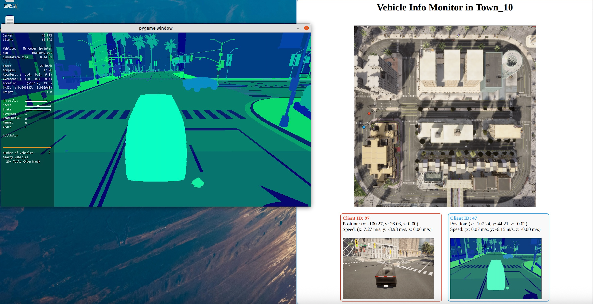

# Tutorial to establish the multi-agent connection based on CARLA and Socket.IO

> [!IMPORTANT]
> Software config: CARLA 0.9.13 Ubuntu 20.04


## 1. 💽Install socket.io
```
# install socket.io 
npm init -y
npm install socket.io
pip install python-socketio
pip install websocket-client

# install plugin for the website
npm install express
express -V
```

## 2. 🚀Run socket server
```
node server_socket.js
```

## 3.🚀 Run ```manual_control_with_websocket.py``` on the CARLA host and client
```
# host
cd ~/carla
./CarlaUE4.sh -carla-rpc-port=2000 -carla-server -carla-rpc-bind=<HOST_IP> (default: 192.168.1.1)
python3 manual_control_with_websocket.py

# client
python3 manual_control_with_websocket.py --host <HOST_IP>(default: 192.168.1.1) --port 2000

```

## 4.🚀 Run ```website.html``` to get the real-time img and info.



## 5.📚 Other resources
You can use ```Town10_BEV_Capture.py``` to capture the BEV image of any map in CARLA
